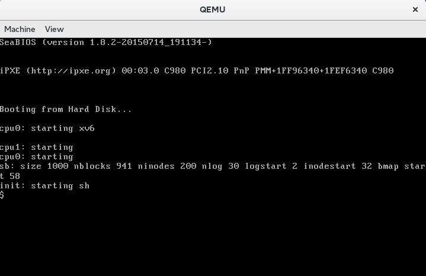

Title: Getting started with the xv6 operating system 
Date: 2016-04-18 
Slug: getting-started-xv6

xv6 is a nifty operating system that is essentially a reimplementation of [Sixth Edition Unix](https://en.wikipedia.org/wiki/Version_6_Unix) that, unlike most of the huge montholithic Linux or BSD distributions that you'd run on your workstation or server, is simple enough to be used as a learning tool. Though xv6 lacks in functionality that you'd expect from a modern operating system, much of the core unix concepts and structure remain the same. xv6 is also very lightweight, only taking a few seconds to compile and allows remote debugging. This all makes it great for understanding how modern operating systems hang together. 

In fact, xv6 was developed by MIT as a teaching operating system for their [6.828 course](https://pdos.csail.mit.edu/6.828/2014/xv6.html). The course page for 6.828 is a great resource that MIT are kind enough to have publicly avaliable. 

MIT also produce a fantastic [xv6 reference book](https://pdos.csail.mit.edu/6.828/2014/xv6/book-rev8.pdf) that provides commentary on the structure of the xv6 operating system. Additionally, the xv6 source actually self documents - the xv6 `make` file contains a target (`make xv6.pdf`) that generates a [pdf of the source code](https://pdos.csail.mit.edu/6.828/2014/xv6/xv6-rev8.pdf), which amazingly comes in under 100 pages and 10k lines of source (including comments!). Not bad for an entire, functional, operating system. 

xv6 is typically run virtualized using qemu on a Linux host machine. To get started with xv6, clone the xv6 repo:

	git clone git://github.com/mit-pdos/xv6-public.git xv6

Then to start it as a virtual machine under qemu:

	cd xv6
	make qemu

If make fails, make sure you have your compiler toolchain installed. There's some good info on the [6.282 tools page](https://pdos.csail.mit.edu/6.828/2014/tools.html). For me, on Fedora, I needed to install gcc with `dnf install gcc`.

Once you have your compiler toolchain working, qemu will pop up and you'll be presented with the xv6 shell. 

 

From here, you'll be able to run a few simple commands like `ls` and `cat` and revel in the knowledge that you can understand what's happening behind the covers by reading through the source code for the shell - line 8500 in the source code listing. 

The core `while` loop the shell executes is shown below. 

	 // Read and run input commands.
	 while(getcmd(buf, sizeof(buf)) >= 0){
	 	if(buf[0] == ’c’ && buf[1] == ’d’ && buf[2] == ’ ’){
	 		// Clumsy but will have to do for now.
	 		// Chdir has no effect on the parent if run in the child.
	 		buf[strlen(buf)−1] = 0; // chop \n
	 	
	 		if(chdir(buf+3) < 0)
	 			printf(2, "cannot cd %s\n", buf+3);
	 		continue;
	 	}
	 	if(fork1() == 0)
	 		runcmd(parsecmd(buf));
	 	wait();
	 }
	 exit();

This loop gets a command from a user, checks if it's the `cd` command and attempts to change directory if it is, otherwise it forks, and runs the entered command in the child process. I personally love how simple and enjoyable the code is to read - check out the rest of the listing for `sh.c` in the xv6 source code pdf - it's only 400 pages of code and a delight to read.

This was only a brief peek and excitement builder for xv6 - there's so many other facets that are worth having a deeper dive into. Join next time when I'll explore the xv6 bootstrap sequence!
