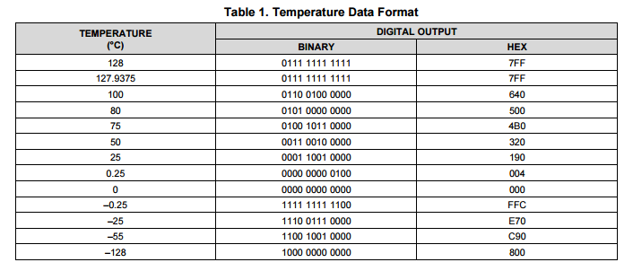
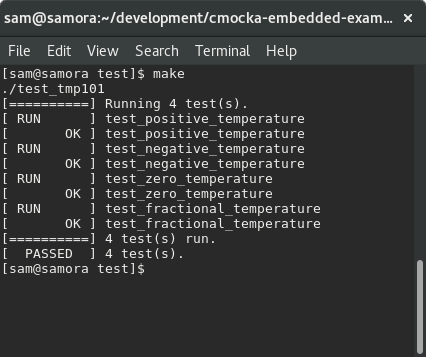

Title: Unit testing embedded code with cmocka
Date: 2016-09-26
Slug: embedded-unit-testing-with-cmocka

# Why unit test embedded software? 
[Unit testing](https://en.wikipedia.org/wiki/Unit_testing) is a great software testing practice that gets a lot of love in web and application development but unfortunately isn't practiced as often in embedded/firmware development. This is a shame as the impacts of having a bug in firmware can be considerably more catastrophic than having a bug in a webapp. I've written this article in the hope of demonstrating some of the benefits that come when writing unit tests for embedded software and have also given a small toy example of how it's possible to unit test firmware using the `cmocka` framework. 

System level embedded software testing is notoriously difficult, mainly because embedded software runs on bare metal hardware. While you can never completely get away from testing embedded software on real hardware, testing the logic in the embedded software through unit testing is very valuable and gets you a lot of the way there. If you still need convincing, some of the things I really like about having unit tests for my embedded code:

- Allows you to develop your application layer logic without the need for any hardware, saving lots of time
- Gives you a greater appreciation and understanding of your hardware periphereals, as you need to understand their interfaces to write tests against them
- Less 'wtf' bugs that are impossible to track down in development/production
- Allows you to test your code against edge cases that otherwise hard to reproduce (eg: testing how your firmware reacts when your temperature sensor is used in negative temperatures)
- Testable code tends to be cleaner, modular and reusable code
- Takes some amount of pressure off your systems level testing
- Stops regressions, particularly if you integrate the tests into your build

There are a lot of unit testing frameworks for `C` but for embedded testing, the framework I like best is [cmocka](https://cmocka.org/). I've looked at others in the past, such as [cmock](http://www.throwtheswitch.org/cmock/) and [cutest](https://github.com/mity/cutest) but cmocka stands out as having all testing & mocking functionality I need while having minimal dependencies. 

On caveat worth mentioning is that to properly use these frameworks, you'll most likely need to compiler your code with a different compiler to what your compile with for your hardware - both so that the framework can run and so that you can execute the tests on your workstation. However, this shouldn't present a major problem as long as you're not relying on non-standard or undefined compiler behaviour. Logic errors in your code will still be logic errors no matter what compiler you use to compile the code. 

# An example of unit testing C in an embedded context
To give a concrete example of how you could make use of `cmocka` in an embedded context, I'll show the process of unit testing code for a temperature sensor. I've chosen the TI [TMP101](http://www.ti.com/lit/ds/symlink/tmp101.pdf) as the temperature sensor, which is a temperature sensor that works over I2C. The complete listing of code [is checked in on my github](https://github.com/samvrlewis/cmocka-embedded-example/), the below text gives a rundown of how it all comes together. 

The first step as normal, is to write some code for the tmp101 sensor that can fetch a temperature. You can find the full code listing [on my github](https://github.com/samvrlewis/cmocka-embedded-example/blob/master/src/tmp101.c). It's also reproduced below. 

	#include "tmp101.h"

	static const float TMP_BIT_RESOLUTION = 0.0625;

	float tmp101_get_temperature(void) 
	{   
	    // Need to set the TMP101 pointer register to point to the temp register
	    uint8_t pointer_address = 0;
	    i2c_transmit_blocking(TMP101_ADDRESS, 0, &pointer_address, 1);

	    // The TMP101 stores 12 bit samples that are retrieved in two byte blocks
	    uint8_t data[2];
	    i2c_read_blocking(TMP101_ADDRESS, 0, &data[0], 2);

	    // the 1st byte is bits 12 to 4 of the sample and the 2nd byte is bits 4 to 0
	    // see page 16 of the TMP_101 datasheet
	    uint16_t temperature_bits = (data[0] << 4) | (data[1] >> 4);

	    // The 12 bit sample is represented using 2s complement, for simplicity 
	    // (and because there's no 12 bit int representation), scale up the sample
	    // to 16 bits and adjust the bit resolution when converting later
	    int16_t temperature = temperature_bits << 4;

	    // shift the sample back down and convert by the TMP_101 bit resolution
	    return ((temperature / 16) * 0.0625f);
	}

This function isn't the most complicated function but there's enough bit manipulation to make me nervous and unsure if it'll do exactly what I want all the time. Sure, we could run it on my hardware platform and see how it responds but that'd only prove that it works as whatever temperature it is now. Instead, lets write some unit tests for this code. 

Conveniently, for this particular temperature sensor, TI are kind enough to provide a table of example temperatures with their corresponding 12 bit digital outputs. These prove a nice place to start in testing our `get_temperature` function. 

In essence, we want to control the data that `i2c_read_blocking` returns to our `tmp101_get_temperature` function so that we can check against our function works as it should. A simple (but somewhat ugly) way to this might be to have the function look something like:

	void i2c_read_blocking(uint8_t address, uint8_t offset, uint8_t* pData, uint8_t data_size)
	{
		#ifdef TESTING
		return DUMMY_VALUE
		#endif

		//normal i2c logic here
	}

But mixing test code with production code is ugly and an antipattern that should be avoided if possible. A much better way that allows us to both completely separate our testing and source code is to use the `cmocka` framework to help us (dynamically!) control what our `i2c_read_blocking` function does. The first step of using `cmocka` is to define mocks for the functions you want to mock out. The two mocked functions are shown below.

	void __wrap_i2c_transmit_blocking(uint8_t address, uint8_t offset, uint8_t* data, uint8_t data_size)
	{
	    // allows the calling test to check if the supplied parameters are as expected
	    check_expected(address);
	    check_expected(offset);
	}

	void __wrap_i2c_read_blocking(uint8_t address, uint8_t offset, uint8_t* pData, uint8_t data_size) 
	{
	    // allow the calling test to specify the data it wants back
	    // and copy it back out
	    for(int i=0; i < data_size; i++) {
	        pData[i] = mock_type(uint8_t);
	    }
	}

 `cmocka` cleverly uses the linker to swap out the real function calls for the mocked ones. To allow for this, mocked out functions are prefixed with `__wrap_`. The linker is then provided with the arguments `--wrap=i2c_read_blocking -Wl,--wrap=i2c_transmit_blocking` which allows these functions to be mocked out. For a complete example of compiling/linking with cmocka, see the [makefile](https://github.com/samvrlewis/cmocka-embedded-example/blob/master/test/Makefile) in my example project.

 With the mocks in place we can now write some tests! A complete look at the tests in my example project can be found [on my github](https://github.com/samvrlewis/cmocka-embedded-example/blob/master/test/test_tmp101.c) but, as an example, here's a single test:

	static void test_negative_temperature(void **state)
	{
	    will_return(__wrap_i2c_read_blocking, 0b11100111);
	    will_return(__wrap_i2c_read_blocking, 0b00000000);

	    assert_true(tmp101_get_temperature() == -25);
	}

The two calls to `will_return` set what the `i2c_read_blocking` function writes into the `pData` array. As per the datasheet, the 12 bit sample is returned over two bytes so these values correspond (from the above TI table) to -25 degrees celsius, which we check against. Much easier than having to stick the temperature sensor in the freezer!

Running all of the tests through a Makefile gives this cool print out:

Although this is just a simple example, it hopefully demonstrates the utility that having unit tests can provide. Having a suite of unit tests for a project gives developers a lot of confidence - I find unit tests especially useful in developing  application layer protocols on top of lower level protocols.

If you're interested in poking around a little at the source for this example, see how it's all linked together an run as a test or even run it yourself, all code for this is avaliable [on my github](https://github.com/samvrlewis/cmocka-embedded-example/) with instructions of how to run.

I hope you found this article interesting, if you have any question please don't hesitate to let me know! 
